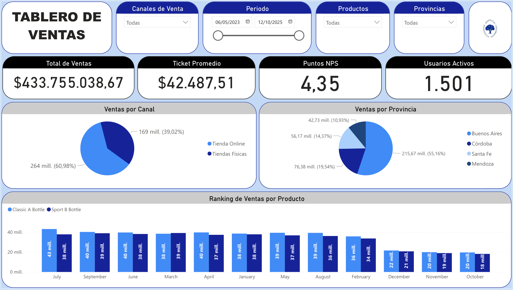
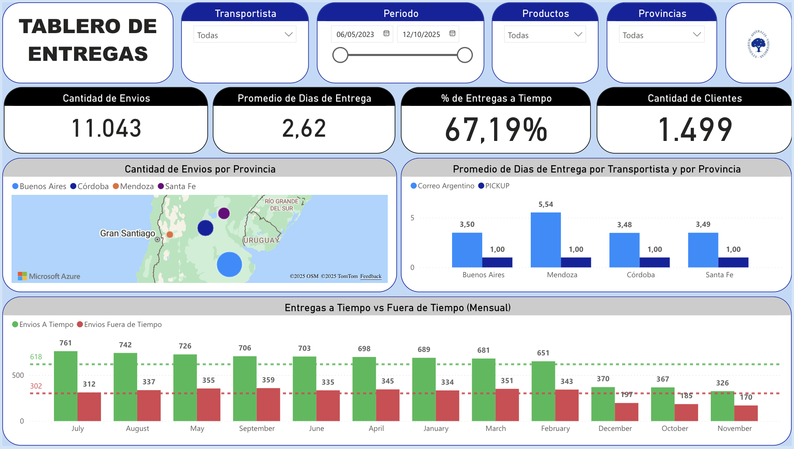
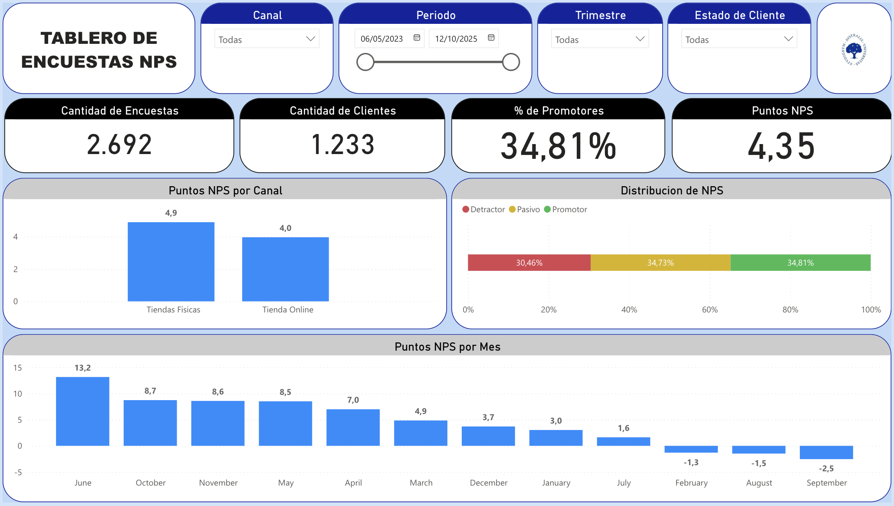
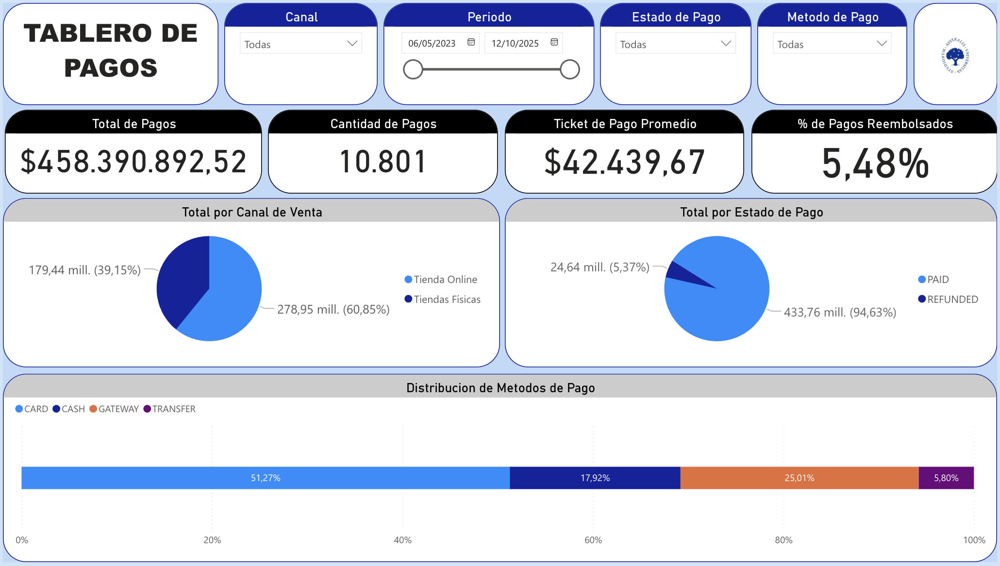
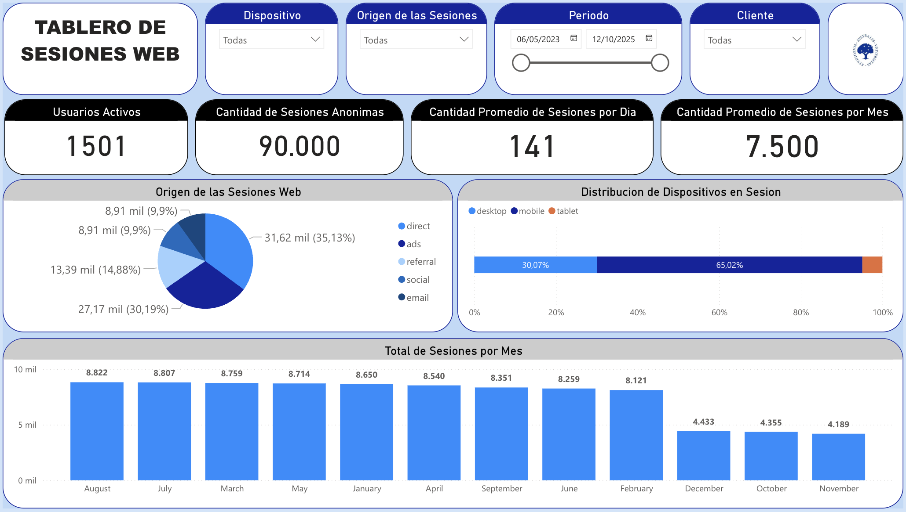
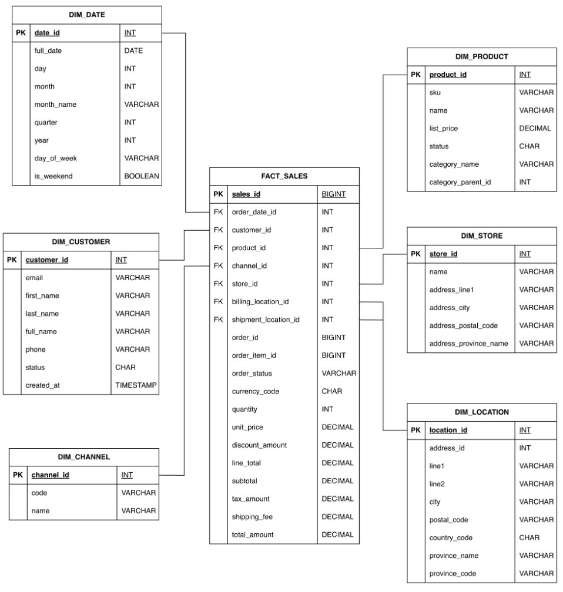
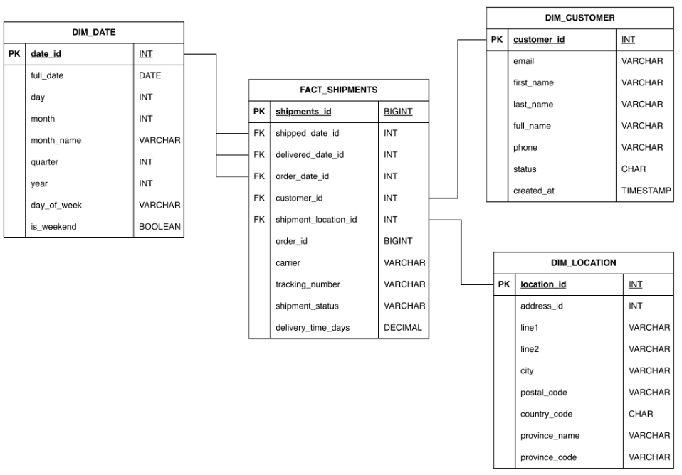
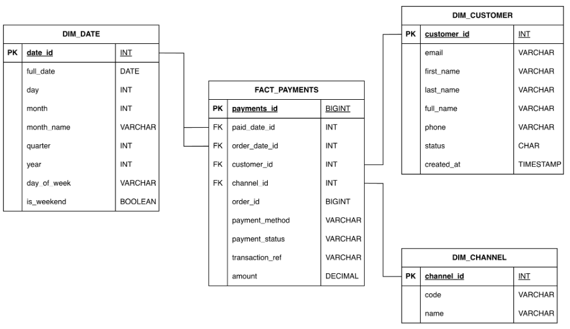
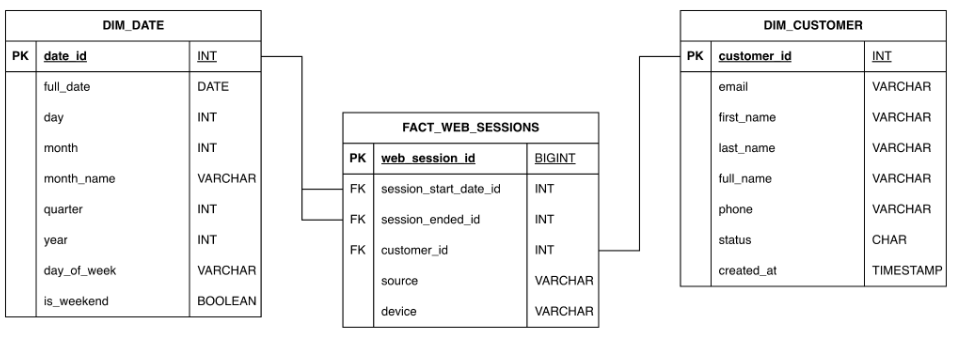
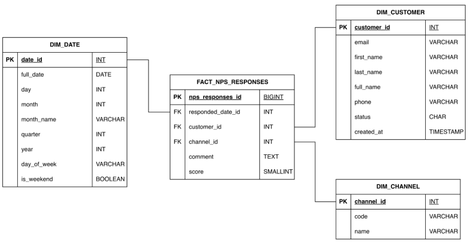

# Trabajo Práctico Final — Introducción al Marketing Online y los Negocios Digitales

Repositorio del trabajo práctico final de la materia.

**Consigna y documento principal:** [Trabajo Práctico Final](https://docs.google.com/document/d/15RNP3FVqLjO4jzh80AAkK6mUR5DOLqPxLjQxqvdzrYg/edit?usp=sharing)
**Diagrama Entidad Relación:** [DER](./assets/DER.png)

**Enlace al Dashboard Final:** [DASHBOARD](https://app.powerbi.com/view?r=eyJrIjoiODUyNmQxZDUtOTI2OS00NTcxLTljYTUtOTIwNzJhOTgwNjZkIiwidCI6IjNlMDUxM2Q2LTY4ZmEtNDE2ZS04ZGUxLTZjNWNkYzMxOWZmYSIsImMiOjR9)

* Dashboard de Ventas:



* Dashboard de Entregas:



* Dashboard de Encuestas NPS:



* Dashboard de Pagos:



* Dashboard de Sesiones Web:



---

## Supuestos
El proyecto fue desarrollado bajo los siguientes supuestos:

### Entorno de Ejecución

* El proyecto se ejecuta en python 3.10 o superior.
* Las librerías necesarias están instaladas.
* Se ejecuta desde la raíz del proyecto.

### Estructura del Proyecto

El proyecto sigue una estructura de ETL conformada por:

* `raw/`: Contiene los archivos de la OLTP.
* `etl/`: Contiene los scripts del proceso de ETL, seprarada en:
    - `etl/extract/`: Contiene el script para leer los datos desde `raw/`.
    - `etl/transform/`: Contiene los scripts para desnormalizar la OLTP en DIM y FACT tables.
    - `etl/load/`: Contiene el script de pipeline para guardar las DIM y FACT tables.
* `main.py`: El script principal que ejecuta el pipeline.
* `werehouse/`: Contiene los archivos creados para el OLAP, se divide en:
    - `werehouse/dim/`: Contiene las tablas de dimensiones.
    - `werehouse/fact/`: Contiene las tablas de hechos.

---

## Instrucciones de Ejecución

Siga estos pasos para ejecutar el pipeline de ETL localmente:

#### 1. **Clonar el repositorio:**
```bash
git clone https://github.com/SantinoMalatini/mkt_tp_final.git
cd mkt_tp_final
```

#### 2. **Crear y Activar un ENV:**
 - En macOS/Linux
```bash
python -m venv .venv
source .venv/bin/activate
```
- En Windows
``` bash
python -m venv .venv
.\.venv\Scripts\activate
```

### 3. **Instalar Dependencias:**

```bash
pip install -r requirements.txt
```

#### 4. **Ejecutar el pipeline ETL:**

```bash
python main.py
```

---

## Diccionario de Datos

El Data Warehouse se compone de las siguientes tablas:

### **Dimensiones:**
* `dim_customer.csv`: Contiene información de los clientes, como identificadores, nombres y datos de contacto.
    - Columnas:
        | **Nombre**     | **Descripción**                 | **Tipo de dato** |
        |----------------|----------------------------------|------------------|
        | `customer_id`  | Clave subrogada (PK)             | INT              |
        | `email`        | Email del cliente                | VARCHAR          |
        | `first_name`   | Nombre del cliente               | VARCHAR          |
        | `last_name`    | Apellido del cliente             | VARCHAR          |
        | `full_name`    | Nombre y apellido del cliente     | VARCHAR          |
        | `phone`        | Teléfono del cliente             | VARCHAR          |
        | `status`       | Estado del cliente               | CHAR             |
        | `created_at`   | Fecha de carga del cliente       | TIMESTAMP        |

* `dim_product.csv`: Contiene informació de los productos como identificadores, SKU, nombre, precio y categoria.
    - Columnas:
        | **Nombre**            | **Descripción**                                         | **Tipo de dato** |
        |------------------------|----------------------------------------------------------|------------------|
        | `product_id`           | Clave subrogada (PK)                                    | INT              |
        | `sku`                  | Código de identificación del producto                    | VARCHAR          |
        | `name`                 | Nombre del producto                                     | VARCHAR          |
        | `list_price`           | Precio de lista                                         | DECIMAL          |
        | `status`               | Estado del producto                                     | CHAR             |
        | `category_name`        | Nombre de la categoría del producto                      | VARCHAR          |
        | `category_parent_id`   | ID de la categoría principal de la categoría             | INT              |


* `dim_location.csv`: Contiene información de las direcciones como ciudad, codigo postal, provincia y pais.
    - Columnas:
        | **Nombre**        | **Descripción**                                  | **Tipo de dato** |
        |--------------------|--------------------------------------------------|------------------|
        | `location_id`      | Clave subrogada (PK)                            | INT              |
        | `address_id`       | ID original de la dirección                     | INT              |
        | `line1`            | Dirección principal                             | VARCHAR          |
        | `line2`            | Detalle adicional de la dirección               | VARCHAR          |
        | `city`             | Nombre de la ciudad                             | VARCHAR          |
        | `postal_code`      | Código postal                                   | VARCHAR          |
        | `country_code`     | Código del país                                 | CHAR             |
        | `province_name`    | Nombre de la provincia                          | VARCHAR          |
        | `province_code`    | Código de la provincia                          | VARCHAR          |

* `dim_store.csv`: Contiene información de las tiendas como identificador, nombre, codigo postal y ciudad.
    - Columnas:
        | **Nombre**              | **Descripción**                 | **Tipo de dato** |
        |--------------------------|----------------------------------|------------------|
        | `store_id`               | Clave subrogada (PK)             | INT              |
        | `name`                   | Nombre de la tienda              | VARCHAR          |
        | `address_line1`          | Dirección de la tienda           | VARCHAR          |
        | `address_city`           | Nombre de la ciudad              | VARCHAR          |
        | `address_postal_code`    | Código postal                    | VARCHAR          |
        | `address_province_name`  | Nombre de la provincia           | VARCHAR          |

* `dim_channel.csv`: Contiene información de los canales como identificador y nombre.
    - Columnas:
        | **Nombre**     | **Descripción**        | **Tipo de dato** |
        |----------------|------------------------|------------------|
        | `channel_id`   | Clave subrogada (PK)   | INT              |
        | `code`         | Código del canal       | VARCHAR          |
        | `name`         | Nombre del canal       | VARCHAR          |

* `dim_date.csv`: Contiene información de los dias como dia, mes y año.
    - Columnas:
        | **Nombre**      | **Descripción**                                   | **Tipo de dato** |
        |-----------------|---------------------------------------------------|------------------|
        | `date_id`       | ID numérico de la fecha (AAAAMMDD) (PK)           | INT              |
        | `full_date`     | Fecha completa                                    | DATE             |
        | `day`           | Número del día del mes                            | INT              |
        | `month`         | Número del mes del año                            | INT              |
        | `month_name`    | Nombre del mes                                    | VARCHAR          |
        | `quarter`       | Número del trimestre del año                      | INT              |
        | `year`          | Año                                               | INT              |
        | `day_of_week`   | Nombre del día de la semana                       | VARCHAR          |
        | `is_weekend`    | Indica si es fin de semana                        | BOOLEAN          |

### **Hechos:**
* `fact_sales.csv`: Registra las ventas realizadas, enlazando productos, clientes, fechas, canales y tiendas.

    - Grano: *El evento de una venta de un producto a un cliente, mediante un canal determinado, en una direccion y en un dia especifico.*
    - Columnas:
        | **Nombre**             | **Descripción**                                   | **Tipo de dato** |
        | ---------------------- | ------------------------------------------------- | ---------------- |
        | `sales_id`             | Clave subrogada (PK)                              | BIGINT           |
        | `order_date_id`        | Fecha de la orden (FK a dim_date)                 | INT              |
        | `customer_id`          | Cliente de la venta (FK a dim_customer)           | INT              |
        | `product_id`           | Producto vendido (FK a dim_product)               | INT              |
        | `channel_id`           | Canal de venta (FK a dim_channel)                 | INT              |
        | `store_id`             | Tienda de la venta (FK a dim_store)               | INT              |
        | `billing_location_id`  | Ubicación de facturación (FK a dim_location)      | INT              |
        | `shipment_location_id` | Ubicación de envío (FK a dim_location)            | INT              |
        | `order_id`             | Identificador de la orden original                | BIGINT           |
        | `order_item_id`        | Identificador del ítem del pedido                 | BIGINT           |
        | `order_status`         | Estado del pedido                                 | VARCHAR          |
        | `currency_code`        | Moneda usada en el pedido                         | CHAR             |
        | `quantity`             | Cantidad de unidades vendidas                     | INT              |
        | `unit_price`           | Precio unitario del producto                      | DECIMAL          |
        | `discount_amount`      | Monto de descuento                                | DECIMAL          |
        | `line_total`           | Total de la línea                                 | DECIMAL          |
        | `subtotal`             | Subtotal del pedido antes de impuestos.           | DECIMAL          |
        | `tax_amount`           | Monto de impuestos aplicados                      | DECIMAL          |
        | `shipping_fee`         | Costo de envío                                    | DECIMAL          |
        | `total_amount`         | Total final del pedido                            | DECIMAL          |

* `fact_shipments.csv`: Registra los envios de pedidos realizados, enlazando fechas, clientes y direcciones.

    - Grano: *El evento de envio de un producto a un cliente en una direccion y dia determinado.*
    - Columnas:
        | **Nombre**             | **Descripción**                                        | **Tipo de dato** |
        | ---------------------- | ------------------------------------------------------ | ---------------- |
        | `shipments_id`         | Clave subrogada (PK)                                   | BIGIN            |
        | `shipped_date_id`      | Fecha en que se despachó el envío (FK a dim_date)      | INT              |
        | `delivered_date_id`    | Fecha en que se entregó el envío (FK a dim_date)       | INT              |
        | `order_date_id`        | Fecha de la orden (FK a dim_date)                      | INT              |
        | `costumer_id`          | Cliente que ralizo el pedido (FK a dim_customer)       | INT              |
        | `shipment_location_id` | Ubicación de destino del envío (FK a dim_location)     | INT              |
        | `order_id`             | Identificador de la orden                              | BIGINT           |
        | `carrier`              | Empresa transportista del envío                        | VARCHAR          |
        | `tracking_number`      | Número de seguimiento del envío                        | VARCHAR          |
        | `shipment_status`      | Estado del envío                                       | VARCHAR          |
        | `delivery_time_days`   | Días entre despacho y entrega                          | DECIMAL          |

* `fact_payments.csv`: Registra los pagos realizados, enlazando fechas, clientes y canales.

    - Grano: *El evento de pago de un cliente por un canal y en un dia determinado.*
    - Columnas:
        | **Nombre**        | **Descripción**                                        | **Tipo de dato** |
        | ----------------- | ------------------------------------------------------ | ---------------- |
        | `payments_id`     | Clave subrogada (PK)                                   | BIGINT           |
        | `paid_date_id`    | Fecha en que se realizó el pago (FK a dim_date)        | INT              |
        | `order_date_id`   | Fecha de la orden (FK a dim_date)                      | INT              |
        | `customer_id`     | Cliente que realizó el pago (FK a dim_customer)        | INT              |
        | `channel_id`      | Canal por el que se efectuó el pago (FK a dim_channel) | INT              |
        | `order_id`        | Identificador de la orden                              | BIGINT           |
        | `payment_method`  | Método de pago utilizado                               | VARCHAR          |
        | `payment_status`  | Estado del pago                                        | VARCHAR          |
        | `transaction_ref` | Código de referencia                                   | VARCHAR          |
        | `amount`          | Monto total del pago                                   | DECIMAL          |

* `fact_web_sessions.csv`: Registra las sesiones web realizadas, enlazando fechas y clientes.

    - Grano: *El evento de una session web de un cliente en un dia determinado.*
    - Columnas:
        | **Nombre**              | **Descripción**                                      | **Tipo de dato** |
        | ----------------------- | ---------------------------------------------------- | ---------------- |
        | `web_session_id`        | Clave subrogada (PK)                                 | BIGINT           |
        | `session_start_date_id` | Fecha de inicio de la sesión (FK a dim_date)         | INT              |
        | `session_ended_id`      | Fecha de finalización de la sesión (FK a dim_date)   | INT              |
        | `customer_id`           | Cliente de la sesión (FK a dim_customer)             | INT              |
        | `source`                | Origen del tráfico                                   | VARCHAR          |
        | `device`                | Dispositivo utilizado                                | VARCHAR          |

* `fact_nps_responses.csv`: Registra las respuesta de las encuestas NPS realizadas, enlazando fechas, clientes y canales.

    - Grano: *El evento de una respuesta a la encuesta NPS de un cliente mediante un canal y en un dia determinado.*
    - Columnas:
        | **Nombre**          | **Descripción**                                          | **Tipo de dato** |
        | ------------------- | -------------------------------------------------------- | ---------------- |
        | `nps_responses_id`  | Clave subrogada (PK)                                     | BIGINT           |
        | `responded_date_id` | Fecha en que el cliente respondió (FK a dim_date)        | INT              |
        | `customer_id`       | Cliente que realizó la respuesta (FK a dim_customer)     | INT              |
        | `channel_id`        | Canal por el que se envió la encuesta (FK a dim_channel) | INT              |
        | `nps_response_id`   | ID original de la encuesta NPS                           | INT              |
        | `comment`           | Comentario del cliente                                   | TEXT             |
        | `score`             | Puntuación otorgada                                      | SMALLINT         |

### Diagramas Star Schema

Se crearon los Star Schema para cada tabla de hechos

* **fact_sales**



* **fact_shipments**



* **fact_payments**



* **fact_web_sessions**



* **fact_nps_responses**

