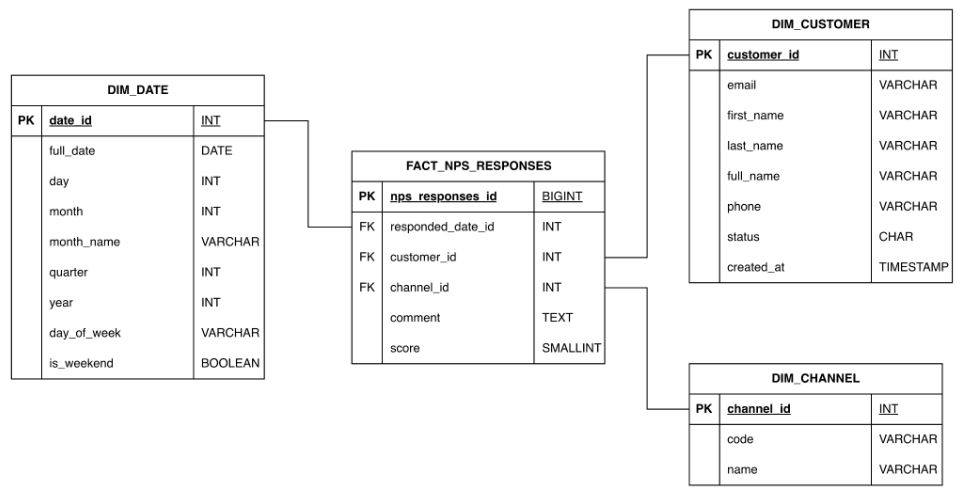

# Trabajo Práctico Final — Introducción al Marketing Online y los Negocios Digitales

Repositorio del trabajo práctico final de la materia.

**Consigna y documento principal:** [Trabajo Práctico Final](https://docs.google.com/document/d/15RNP3FVqLjO4jzh80AAkK6mUR5DOLqPxLjQxqvdzrYg/edit?usp=sharing)
**Diagrama Entidad Relación:** [DER](./assets/DER.png)

**Enlace al Dashboard:** [DASHBOARD](https://app.powerbi.com/view?r=eyJrIjoiODUyNmQxZDUtOTI2OS00NTcxLTljYTUtOTIwNzJhOTgwNjZkIiwidCI6IjNlMDUxM2Q2LTY4ZmEtNDE2ZS04ZGUxLTZjNWNkYzMxOWZmYSIsImMiOjR9)

---

## Supuestos
El proyecto fue desarrollado bajo los siguientes supuestos:

### Entorno de Ejecución

* El proyecto se ejecuta en python 3.10 o superior.
* Las librerías necesarias están instaladas.
* Se ejecuta desde la raíz del proyecto.

### Estructura del Proyecto

El proyecto sigue una estructura de ETL conformada por:

* `raw/`: Contiene los archivos de la OLTP.
* `etl/`: Contiene los scripts del proceso de ETL, seprarada en:
    - `etl/extract/`: Contiene el script para leer los datos desde `raw/`.
    - `etl/transform/`: Contiene los scripts para desnormalizar la OLTP en DIM y FACT tables.
    - `etl/load/`: Contiene el script de pipeline para guardar las DIM y FACT tables.
* `main.py`: El script principal que ejecuta el pipeline.
* `werehouse/`: Contiene los archivos creados para el OLAP, se divide en:
    - `werehouse/dim/`: Contiene las tablas de dimensiones.
    - `werehouse/fact/`: Contiene las tablas de hechos.

---

## Instrucciones de Ejecución

Siga estos pasos para ejecutar el pipeline de ETL localmente:

#### 1. **Clonar el repositorio:**
```bash
git clone https://github.com/SantinoMalatini/mkt_tp_final.git
cd mkt_tp_final
```

#### 2. **Crear y Activar un ENV:**
 - En macOS/Linux
```bash
python -m venv .venv
source .venv/bin/activate
```
- En Windows
``` bash
python -m venv .venv
.\.venv\Scripts\activate
```

### 3. **Instalar Dependencias:**

```bash
pip install -r requirements.txt
```

#### 4. **Ejecutar el pipeline ETL:**

```bash
python main.py
```

---

## Diccionario de Datos

El Data Warehouse se compone de las siguientes tablas:

### **Dimensiones:**
* `dim_customer.csv`: Contiene información de los clientes, como identificadores, nombres y datos de contacto.

* `dim_product.csv`: Contiene informació de los productos como identificadores, SKU, nombre, precio y categoria.

* `dim_location.csv`: Contiene información de las direcciones como ciudad, codigo postal, provincia y pais.

* `dim_store.csv`: Contiene información de las tiendas como identificador, nombre, codigo postal y ciudad.

* `dim_channel.csv`: Contiene información de los canales como identificador y nombre.

* `dim_date.csv`: Contiene información de los dias como dia, mes y año.

### **Hechos:**
* `fact_sales.csv`: Registra las ventas realizadas, enlazando productos, clientes, fechas, canales y tiendas.

    - Grano: *El evento de una venta de un producto a un cliente, mediante un canal determinado, en una direccion y en un dia especifico.*

* `fact_shipments.csv`: Registra los envios de pedidos realizados, enlazando fechas, clientes y direcciones.

    - Grano: *El evento de envio de un producto a un cliente en una direccion y dia determinado.*

* `fact_payments.csv`: Registra los pagos realizados, enlazando fechas, clientes y canales.

    - Grano: *El evento de pago de un cliente por un canal y en un dia determinado.*

* `fact_web_sessions.csv`: Registra las sesiones web realizadas, enlazando fechas y clientes.

    - Grano: *El evento de una session web de un cliente en un dia determinado.*

* `fact_nps_responses.csv`: Registra las respuesta de las encuestas NPS realizadas, enlazando fechas, clientes y canales.

    - Grano: *El evento de una respuesta a la encuesta NPS de un cliente mediante un canal y en un dia determinado.*

### Diagramas Star Schema

Se crearon los Star Schema para cada tabla de hechos

* **fact_sales**


* **fact_shipments**


* **fact_payments**


* **fact_web_sessions**


* **fact_nps_responses**

